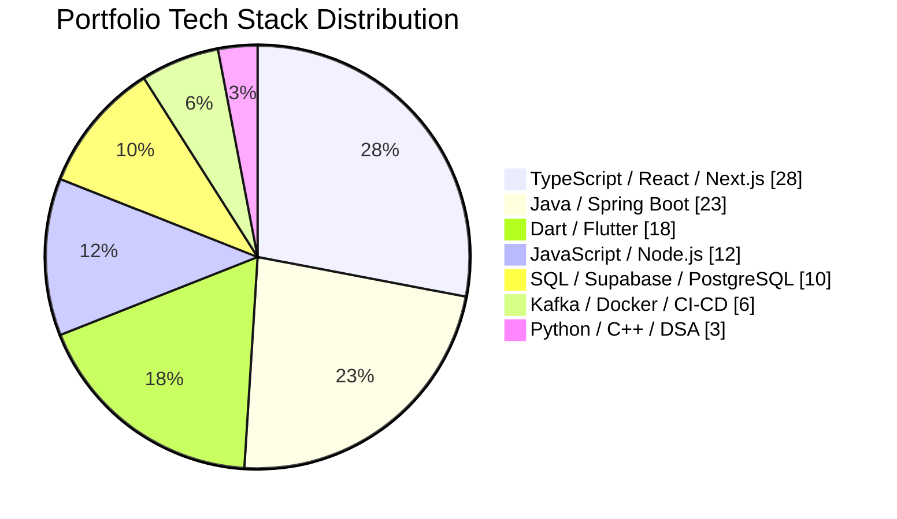
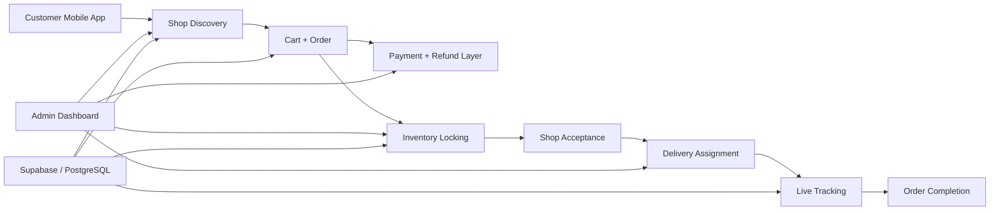
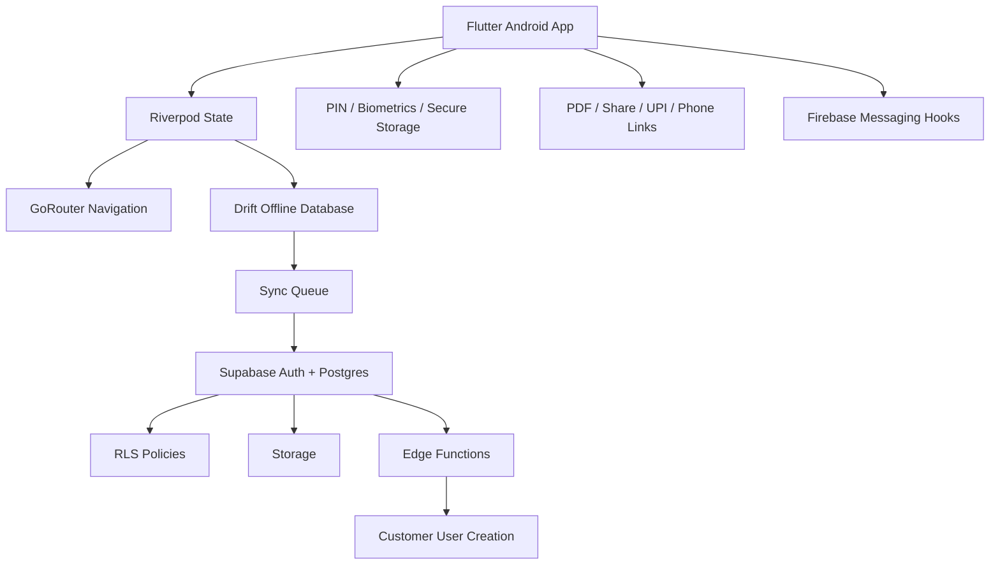
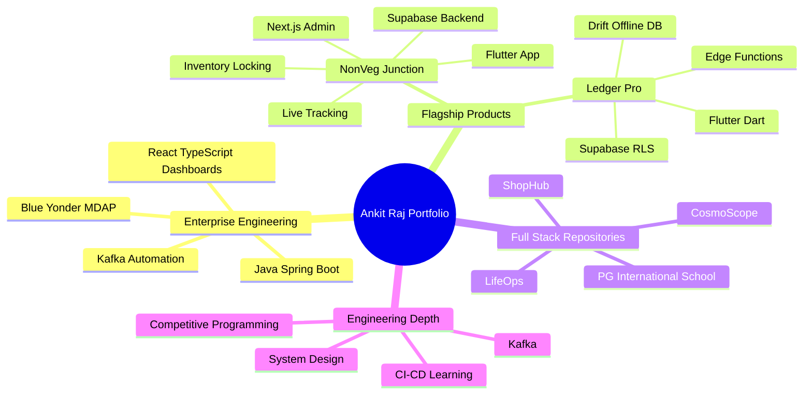

<!--
  Ultra-premium GitHub Profile README for @ankitraj6767
  Positioning: Software Development Engineer | Backend + Full-Stack | Distributed Systems | Product Engineering
  Percentage visuals represent portfolio/resume/project-stack weighting, not exact GitHub language byte statistics.
-->

 

  
  
  
  

  
  
  
  

<h3>Backend-first full-stack engineer building APIs, Kafka workflows, analytics dashboards, Flutter apps, and product-grade systems.</h3>

---

## Executive Impact Snapshot

<table>
  <tr>
    <td width="25%" align="center">
      
       Performance Optimization
    </td>
    <td width="25%" align="center">
      
       Internal Analytics APIs
    </td>
    <td width="25%" align="center">
      
       Kafka Metadata Automation
    </td>
    <td width="25%" align="center">
      
       Reliability Engineering
    </td>
  </tr>
</table>

I am a **Software Development Engineer at Blue Yonder** working on the **Multi-Dimensional Analytics Platform (MDAP)**. My work spans scalable REST APIs, Spring Boot services, Kafka workflows, React + TypeScript analytics dashboards, testing, production debugging, and data-heavy enterprise systems.

---

## Tech Stack Galaxy

 

## Portfolio Tech Mix — Percentage View

> Visual weighting across current professional work, portfolio repositories, and flagship product builds. This is a strategic project-stack distribution, not GitHub byte-level language analytics.

<table>
  <tr>
    <td width="50%"><strong>TypeScript / React / Next.js — 28%</strong> </td>
    <td width="50%"><strong>Java / Spring Boot — 23%</strong> </td>
  </tr>
  <tr>
    <td width="50%"><strong>Dart / Flutter — 18%</strong> </td>
    <td width="50%"><strong>JavaScript / Node.js — 12%</strong> </td>
  </tr>
  <tr>
    <td width="50%"><strong>SQL / Supabase / PostgreSQL — 10%</strong> </td>
    <td width="50%"><strong>Kafka / Docker / CI-CD — 6%</strong> </td>
  </tr>
  <tr>
    <td width="50%"><strong>Python / C++ / DSA — 3%</strong> </td>
    <td width="50%"><strong>Product Architecture Coverage — 100%</strong> </td>
  </tr>
</table>

---

## Flagship Product Command Center

<table>
  <tr>
    <td width="50%" valign="top">
      <h2>🥩 NonVeg Junction</h2>
      
<strong>Fresh non-veg delivery operating system</strong> for chicken, fish, mutton, local shops, delivery partners, payments, refunds, live tracking, and inventory locking.

      

        
        
      

      

        
        
        
        
        
      

      <ul>
        <li>Customer app: browse shops, products, cart, checkout, order tracking.</li>
        <li>Shop module: inventory, pricing, availability, acceptance workflow.</li>
        <li>Delivery module: assignment, route state, proof, live location.</li>
        <li>Admin module: city, zone, shops, payouts, refunds, support, analytics.</li>
      </ul>
    </td>
    <td width="50%" valign="top">
      <h2>📒 Ledger Pro</h2>
      
<strong>Android-first private business ledger app</strong> for bookkeeping, customer finance, project expenses, offline-first records, Supabase-backed permissions, and secure mobile workflows.

      

        
        
      

      

        
        
        
        
        
      

      <ul>
        <li>Offline-first ledger with Drift local database and Supabase sync direction.</li>
        <li>Secure storage, PIN lock, biometrics, PDF sharing, UPI/phone links.</li>
        <li>Customer logins via Edge Function and RLS-backed permission boundary.</li>
        <li>Verification path: Flutter analyze, tests, Android debug build.</li>
      </ul>
    </td>
  </tr>
</table>

---

## Product Architecture Visuals

### NonVeg Junction — Fresh Delivery System Map

### Ledger Pro — Secure Mobile Ledger Architecture

---

## Top Repository Showcase

<table>
  <tr>
    <td width="33%" valign="top">
      <h3>🛒 ShopHub</h3>
      
Full-stack e-commerce platform with product catalog, search/filtering, cart, checkout, orders, admin dashboard, JWT auth, RBAC, Razorpay payments, and optimized media workflows.

      

        
        
        
        
      

    </td>
    <td width="33%" valign="top">
      <h3>🏫 P.G. International School</h3>
      
Production-style school website and management platform with public pages, admin CMS, parent portal, teacher portal, admissions, attendance, notices, fee, results, and role-based access.

      

        
        
        
        
      

    </td>
    <td width="33%" valign="top">
      <h3>🧠 LifeOps</h3>
      
Personal operating system for tasks, habits, goals, journal, mood tracking, expenses, global search, modular architecture, and premium productivity workflows.

      

        
        
        
        
      

    </td>
  </tr>
  <tr>
    <td width="33%" valign="top">
      <h3>🌌 CosmoScope</h3>
      
NASA-powered insight dashboard with APOD, Mars rover imagery, Earth satellite views, asteroid tracking, space weather, image search, and responsive space-themed UI.

      

        
        
        
      

    </td>
    <td width="33%" valign="top">
      <h3>⚡ Kafka / CI-CD</h3>
      
Hands-on backend practice around event streaming, deployment automation, workflow reliability, Docker, and engineering tooling.

      

        
        
        
      

    </td>
    <td width="33%" valign="top">
      <h3>🤖 AI Chatbot / School Systems</h3>
      
AI/product engineering experiments and management-system builds that show dashboard thinking, authenticated workflows, and product-grade UI architecture.

      

        
        
        
      

    </td>
  </tr>
</table>

---

## Repository Portfolio Map

---

## Competitive Programming Signal

<table>
  <tr>
    <td align="center" width="25%">
      
       <strong>1855</strong> Max Rating
    </td>
    <td align="center" width="25%">
      
       <strong>1832</strong> Max Rating
    </td>
    <td align="center" width="25%">
      
       <strong>1937</strong> Rating
    </td>
    <td align="center" width="25%">
      
       <strong>DSA</strong> Problem Solving
    </td>
  </tr>
</table>

---

## GitHub Analytics Dashboard

  

  

  

---

## Current Growth Direction

<table>
  <tr>
    <td width="33%" align="center">
      <h3>System Design</h3>
      
Scalability, consistency, queues, caching, observability, and fault-tolerant architecture.

    </td>
    <td width="33%" align="center">
      <h3>Backend Depth</h3>
      
Spring Boot internals, Kafka patterns, API performance, clean architecture, and reliability.

    </td>
    <td width="33%" align="center">
      <h3>Product Craft</h3>
      
Premium UX, Flutter apps, admin systems, dashboards, data visualization, and real-world usability.

    </td>
  </tr>
</table>

---

<h2>Engineering principle</h2>

<h3>Make the system reliable. Make the interface simple. Make the code maintainable.</h3>

