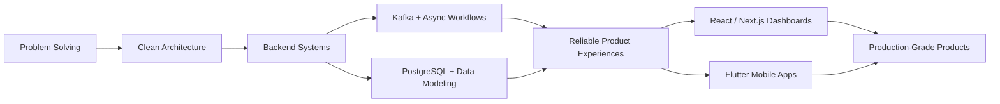
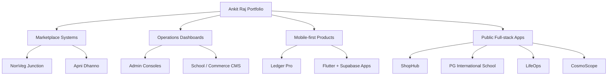
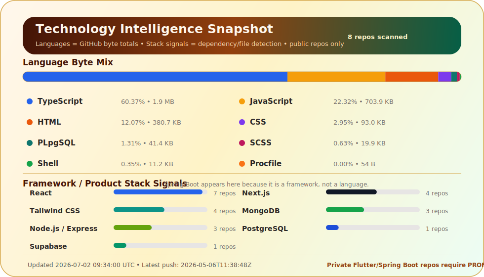

<!--
  Premium GitHub Profile README for @ankitraj6767
  Design goal: recruiter-readable, visually rich, fast-rendering, and aligned with portfolio + repositories.
-->

 

  
  
  
  

  
  
  
  

<h3>Backend-first full-stack engineer focused on reliable APIs, event-driven systems, product dashboards, mobile apps, and clean architecture.</h3>

---

## Executive Signal

<table>
  <tr>
    <td width="20%" align="center"><strong>Current Role</strong> Software Development Engineer Blue Yonder</td>
    <td width="20%" align="center"><strong>Education</strong> B.Tech CSE NIT Silchar</td>
    <td width="20%" align="center"><strong>Core Backend</strong> Java • Spring Boot Kafka • PostgreSQL</td>
    <td width="20%" align="center"><strong>Product Stack</strong> React • Next.js Flutter • Supabase</td>
    <td width="20%" align="center"><strong>Problem Solving</strong> LeetCode Knight Codeforces Expert</td>
  </tr>
</table>

I work on **backend-heavy enterprise systems** and also build complete products end-to-end — from database schema, APIs, realtime workflows, and role-based access to polished dashboards and mobile experiences.

---

## Engineering Operating System

<table>
  <tr>
    <td width="33%" valign="top"><h3>⚙️ Backend Systems</h3>
Spring Boot services, REST APIs, Kafka consumers/producers, validation flows, testing, debugging, and performance-oriented engineering.
</td>
    <td width="33%" valign="top"><h3>📊 Product Dashboards</h3>
React, TypeScript, Next.js, Tailwind, admin consoles, analytics panels, forms, tables, filters, and clean user workflows.
</td>
    <td width="33%" valign="top"><h3>📱 Mobile + Realtime</h3>
Flutter apps with Supabase, auth, Postgres, realtime sync, offline-aware flows, permissions, and production-style app architecture.
</td>
  </tr>
</table>

---

## Impact Highlights

<table>
  <tr>
    <td width="25%" align="center"> High-throughput backend pipelines</td>
    <td width="25%" align="center"> JUnit / Mockito / integration quality</td>
    <td width="25%" align="center"> Full-stack and product builds</td>
    <td width="25%" align="center"> Algorithms + interview depth</td>
  </tr>
</table>

---

## Tech Stack

 

<table>
  <tr>
    <td width="50%"><strong>Backend Engineering</strong> Java, Spring Boot, Node.js, Express, NestJS, REST APIs, auth, testing</td>
    <td width="50%"><strong>Event + Data Systems</strong> Kafka, PostgreSQL, MongoDB, MySQL, Redis, Supabase, SQL design</td>
  </tr>
  <tr>
    <td width="50%"><strong>Frontend Engineering</strong> React, TypeScript, Next.js, Redux, Tailwind CSS, Framer Motion</td>
    <td width="50%"><strong>Mobile + Product</strong> Flutter, Dart, Riverpod, GoRouter, realtime flows, admin dashboards</td>
  </tr>
  <tr>
    <td width="50%"><strong>Dev Tools</strong> Docker, GitHub Actions, Postman, Vercel, Netlify, Cloudinary, Firebase</td>
    <td width="50%"><strong>CS Foundation</strong> DSA, OOP, OS, DBMS, Computer Networks, System Design, Distributed Systems</td>
  </tr>
</table>

---

## Product Portfolio Command Center

 

<table>
  <tr>
    <td width="50%" valign="top">
      <h2>🥩 NonVeg Junction</h2>
      
<strong>Fresh meat quick-commerce operating system</strong> for 10–20 minute fresh chicken, fish, mutton, seafood, egg, and ready-to-cook delivery through nearby verified local shops.

      
   

      <ul>
        <li><strong>Product depth:</strong> customer app, shop partner app, delivery partner app, admin dashboard, order lifecycle, inventory locking, support, payouts, refunds, and live tracking.</li>
        <li><strong>Engineering depth:</strong> Supabase schema, RLS, Edge Functions, realtime sync, shared packages, dynamic config, launch checklist, and production-readiness gates.</li>
        <li><strong>UX focus:</strong> clean marketplace browsing, fast cart/checkout, partner operation states, delivery visibility, and admin control surfaces.</li>
      </ul>
    </td>
    <td width="50%" valign="top">
      <h2>🏍️ Apni Dhanno</h2>
      
<strong>Self-drive car and bike rental product</strong> for mobile booking, KYC, vehicle discovery, admin operations, fleet readiness, trip evidence, payments, refunds, and Ranchi-first launch workflows.

      
   

      <ul>
        <li><strong>Product depth:</strong> vehicle catalog, city/branch operations, booking flow, Prime subscriptions, fleet partner onboarding, user management, reports, support, and CMS settings.</li>
        <li><strong>Engineering depth:</strong> Supabase Auth, hardened RLS, private Storage, Razorpay booking/Prime functions, payment webhooks, refunds, trip start/end Edge Functions, and SQL security checks.</li>
        <li><strong>Status discipline:</strong> positioned as launch-gated; real Ranchi sandbox dry-run, Razorpay evidence, target-data checks, and physical-device QA remain the release gate.</li>
      </ul>
    </td>
  </tr>
  <tr>
    <td width="50%" valign="top">
      <h2>📒 Ledger Pro</h2>
      
<strong>Secure mobile ledger system</strong> for customer books, project expenses, offline-first records, customer access, PDFs, UPI/phone actions, and privacy-first business workflows.

      
   

      <ul>
        <li><strong>Product depth:</strong> customer ledger, transactions, reminders, expense tracking, secure access, PDF/share flows, phone/UPI actions, and business-friendly mobile UX.</li>
        <li><strong>Engineering depth:</strong> local-first direction with Drift, Supabase sync boundary, RLS-backed access, secure storage, app routing, and practical verification path.</li>
        <li><strong>UX focus:</strong> fast entry, low-friction bookkeeping, trustworthy privacy surfaces, and clean mobile information hierarchy.</li>
      </ul>
    </td>
    <td width="50%" valign="top">
      <h2>🛒 ShopHub E-commerce</h2>
      
<strong>Full-stack commerce platform</strong> with catalog, deals, flash sale style flows, cart, checkout, orders, admin analytics, authentication, Cloudinary, Razorpay, and notifications.

      
   

      <ul>
        <li><strong>Product depth:</strong> product listing, filtering, wishlist, cart, payments, order management, admin dashboard, revenue tracking, and customer-facing ecommerce flows.</li>
        <li><strong>Engineering depth:</strong> React, Redux Toolkit, Node.js, Express, MongoDB, JWT auth, Cloudinary media workflows, Razorpay payment integration, and email notifications.</li>
        <li><strong>UX focus:</strong> conversion-friendly browsing, clear product cards, smooth checkout, and admin visibility for business operations.</li>
      </ul>
    </td>
  </tr>
  <tr>
    <td width="50%" valign="top">
      <h2>🏫 PG International School</h2>
      
<strong>School website and CMS platform</strong> with bilingual content, admissions, public pages, admin workflows, REST APIs, Cloudinary media, and polished parent-facing UX.

      
   

      <ul>
        <li><strong>Product depth:</strong> admission flow, content management, notices, media sections, bilingual pages, school profile, and non-technical admin controls.</li>
        <li><strong>Engineering depth:</strong> Next.js, TypeScript, Node.js/Express APIs, MongoDB, JWT, Tailwind, Framer Motion, Cloudinary, and protected admin workflows.</li>
        <li><strong>UX focus:</strong> credible institutional look, responsive layouts, clear admissions path, and CMS-driven content freshness.</li>
      </ul>
    </td>
    <td width="50%" valign="top">
      <h2>🧠 LifeOps</h2>
      
<strong>Personal productivity operating system</strong> for tasks, habits, goals, journal, mood analytics, expenses, auth, dashboard modules, and daily self-management workflows.

      
   

      <ul>
        <li><strong>Product depth:</strong> task management, habit streaks, goals, journaling, mood tracking, expense breakdowns, modular dashboard, and focused personal workflows.</li>
        <li><strong>Engineering depth:</strong> Next.js, TypeScript, Tailwind, React Query, Zustand, NestJS, MongoDB, JWT, modular frontend state, and backend API structure.</li>
        <li><strong>UX focus:</strong> dashboard clarity, habit feedback loops, simple daily capture, and a premium productivity feel.</li>
      </ul>
    </td>
  </tr>
  <tr>
    <td width="50%" valign="top">
      <h2>🌌 CosmoScope</h2>
      
<strong>NASA-powered space dashboard</strong> that turns open space data into a responsive visual exploration experience with APOD, imagery, asteroid insight, and data-display flows.

      
   

      <ul>
        <li><strong>Product depth:</strong> educational exploration, space content cards, image-led discovery, API-backed data views, and responsive visual storytelling.</li>
        <li><strong>Engineering depth:</strong> React, Tailwind CSS, NASA APIs, data fetching, responsive states, and clean presentation of API-driven content.</li>
        <li><strong>UX focus:</strong> immersive dark UI, readable astronomy content, visual hierarchy, and smooth exploration.</li>
      </ul>
    </td>
    <td width="50%" valign="top">
      <h2>🧩 Systems Practice</h2>
      
<strong>Engineering depth repositories</strong> covering interview DSA, Kafka practice, CI/CD learning, Spring Boot + React builds, school systems, restaurant/hotel workflows, and smaller utility apps.

      
  

      <ul>
        <li><strong>Product depth:</strong> focused builds for learning, reusable patterns, admin flows, API experiments, and real-world CRUD/product practice.</li>
        <li><strong>Engineering depth:</strong> Java, Spring Boot, React, GitHub Actions, Docker, Kafka, algorithm practice, and debugging workflows.</li>
        <li><strong>UX focus:</strong> practical layouts, responsive interfaces, and project-by-project iteration toward cleaner production patterns.</li>
      </ul>
    </td>
  </tr>
</table>

---

## Project Capability Matrix

<table>
  <tr>
    <th align="left">Project</th>
    <th align="left">Domain</th>
    <th align="left">Core Modules</th>
    <th align="left">Engineering Signal</th>
  </tr>
  <tr><td><strong>NonVeg Junction</strong></td><td>Fresh meat quick commerce</td><td>Customer, shop, delivery, admin, payments, inventory, live tracking</td><td>Flutter, Supabase, RLS, Edge Functions, realtime, launch gates</td></tr>
  <tr><td><strong>Apni Dhanno</strong></td><td>Self-drive vehicle rental</td><td>Booking, KYC, fleet, admin, trip evidence, refunds, Prime</td><td>Flutter, Next.js, Supabase, private Storage, Razorpay, DigiLocker</td></tr>
  <tr><td><strong>Ledger Pro</strong></td><td>Business ledger utility</td><td>Customer books, expenses, offline records, PDFs, secure access</td><td>Flutter, Drift, Riverpod, Supabase, secure storage direction</td></tr>
  <tr><td><strong>ShopHub</strong></td><td>E-commerce</td><td>Catalog, cart, checkout, orders, admin, payments, notifications</td><td>React, Redux, Node.js, Express, MongoDB, Cloudinary, Razorpay</td></tr>
  <tr><td><strong>PG International School</strong></td><td>School CMS</td><td>Public site, admissions, bilingual CMS, media, admin workflows</td><td>Next.js, TypeScript, REST APIs, MongoDB, Cloudinary, JWT</td></tr>
  <tr><td><strong>LifeOps</strong></td><td>Personal productivity</td><td>Tasks, habits, goals, journal, mood, expenses, dashboard</td><td>Next.js, TypeScript, NestJS, MongoDB, React Query, Zustand</td></tr>
  <tr><td><strong>CosmoScope</strong></td><td>Space data dashboard</td><td>NASA data, imagery, asteroid insights, responsive exploration UI</td><td>React, Tailwind, NASA APIs, data presentation</td></tr>
</table>

---

## Professional Experience Snapshot

<table>
  <tr>
    <td width="50%" valign="top">
      <h3>Software Development Engineer</h3>
      
<strong>Blue Yonder India Private Limited</strong> July 2024 — Present

      <ul>
        <li>Build Spring Boot APIs and Kafka workflows for data-heavy enterprise systems.</li>
        <li>Work across backend services, PostgreSQL, React + TypeScript dashboards, tests, debugging, and production reliability.</li>
        <li>Collaborate with product, QA, and DevOps teams to ship maintainable platform features.</li>
      </ul>
    </td>
    <td width="50%" valign="top">
      <h3>SDE Intern</h3>
      
<strong>Blue Yonder India Private Limited</strong> January 2024 — June 2024

      <ul>
        <li>Implemented RESTful services, Kafka producers/consumers, database schemas, and SQL optimizations.</li>
        <li>Contributed to React UI components, Swagger/OpenAPI documentation, sprint work, and code-quality improvements.</li>
        <li>Converted internship work into full-time engineering ownership.</li>
      </ul>
    </td>
  </tr>
</table>

---

## Competitive Programming

<table>
  <tr>
    <td align="center" width="25%"> <strong>1852</strong> Max Rating</td>
    <td align="center" width="25%"> <strong>1832</strong> Max Rating</td>
    <td align="center" width="25%"> <strong>1937</strong> Rating</td>
    <td align="center" width="25%"> <strong>DSA</strong> Practice Depth</td>
  </tr>
</table>

---

## GitHub Analytics

  

 

Language card is generated from GitHub repository language bytes by <code>.github/workflows/update-language-snapshot.yml</code>. It updates on push to this profile repo, manual workflow run, and every 6 hours. Add <code>PROFILE_STATS_TOKEN</code> as a repository secret to include private repositories.

  

  

  

---

## Current Growth Direction

<table>
  <tr>
    <td width="33%" align="center"><h3>System Design</h3>
Scalability, queues, caching, consistency, observability, and fault-tolerant services.
</td>
    <td width="33%" align="center"><h3>Backend Depth</h3>
Spring Boot internals, Kafka patterns, API performance, testing, and reliability.
</td>
    <td width="33%" align="center"><h3>Product Craft</h3>
Premium UX, Flutter apps, admin systems, dashboards, data visualization, and usability.
</td>
  </tr>
</table>

---

<h2>Engineering Principle</h2>

<h3>Make the system reliable. Make the interface simple. Make the code maintainable.</h3>

  
  

