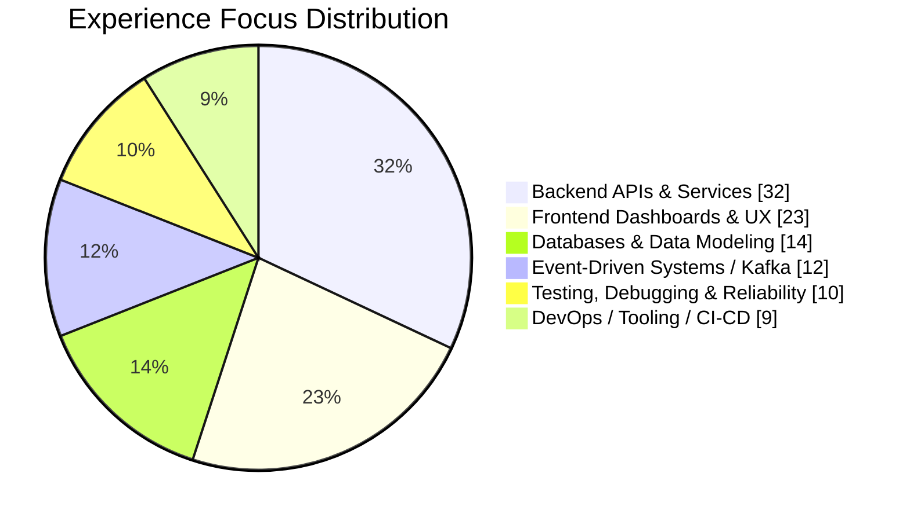
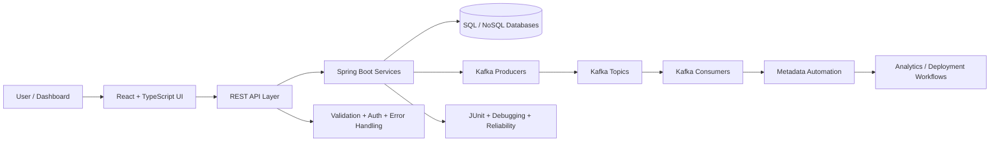

<!--
  Ultra-premium GitHub Profile README for @ankitraj6767
  Positioning: Software Development Engineer | Backend + Full-Stack | Distributed Systems
  Note: Percentage visuals below represent resume + project experience focus, not exact GitHub language statistics.
-->

 

  
  
  
  

  
  
  

<h3>Backend-first full-stack engineer building APIs, Kafka workflows, analytics dashboards, and product-grade systems.</h3>

---

## Executive Snapshot

<table>
  <tr>
    <td width="25%" align="center">
      
       Performance Optimization
    </td>
    <td width="25%" align="center">
      
       Internal Analytics APIs
    </td>
    <td width="25%" align="center">
      
       Kafka Metadata Automation
    </td>
    <td width="25%" align="center">
      
       Problem Solving
    </td>
  </tr>
</table>

I am a **Software Development Engineer at Blue Yonder** working on the **Multi-Dimensional Analytics Platform (MDAP)**. My engineering work sits at the intersection of scalable APIs, event-driven backend workflows, React + TypeScript dashboards, testing, production reliability, and data-heavy enterprise systems.

---

## Premium Engineering Identity

<table>
  <tr>
    <td width="50%" valign="top">
      <h3>Backend & Distributed Systems</h3>
      

        Designing REST APIs, Spring Boot services, Kafka-driven automation, validation flows, metadata orchestration, and reliable backend modules for analytics-heavy systems.
      

      

        
        
        
        
        
      

    </td>
    <td width="50%" valign="top">
      <h3>Full-Stack Product Engineering</h3>
      

        Building polished dashboards, admin systems, auth flows, CMS experiences, data visualization interfaces, and production-style web platforms.
      

      

        
        
        
        
        
      

    </td>
  </tr>
</table>

---

## Tech Stack Galaxy

 

### Experience Focus Percentage Chart

> These percentages represent practical exposure across resume work, portfolio projects, and current engineering direction — not exact GitHub language statistics.

### Tech Depth Bars

<table>
  <tr>
    <td width="50%">
      <strong>Java + Spring Boot</strong> 
      
    </td>
    <td width="50%">
      <strong>REST APIs + Microservices</strong> 
      
    </td>
  </tr>
  <tr>
    <td width="50%">
      <strong>React + TypeScript</strong> 
      
    </td>
    <td width="50%">
      <strong>Kafka + Event Workflows</strong> 
      
    </td>
  </tr>
  <tr>
    <td width="50%">
      <strong>Database Engineering</strong> 
      
    </td>
    <td width="50%">
      <strong>Testing + Production Debugging</strong> 
      
    </td>
  </tr>
  <tr>
    <td width="50%">
      <strong>System Design</strong> 
      
    </td>
    <td width="50%">
      <strong>Docker + CI/CD Tooling</strong> 
      
    </td>
  </tr>
</table>

---

## Architecture Thinking

---

## Selected Product-Grade Projects

<table>
  <tr>
    <td width="50%" valign="top">
      <h3>ShopHub</h3>
      
Full-stack e-commerce platform with catalog, advanced filtering, cart, checkout, order lifecycle, admin dashboard, JWT auth, RBAC, Razorpay payments, and optimized media workflows.

      

        
        
        
        
      

    </td>
    <td width="50%" valign="top">
      <h3>P.G. International School Platform</h3>
      
Production-style school website and management system with public website, admin CMS, parent portal, teacher portal, attendance, results, notices, admissions, and role-based access.

      

        
        
        
        
      

    </td>
  </tr>
  <tr>
    <td width="50%" valign="top">
      <h3>LifeOps</h3>
      
Premium personal life-management platform covering tasks, habits, goals, journal, mood tracking, expenses, global search, and modular full-stack architecture.

      

        
        
        
        
      

    </td>
    <td width="50%" valign="top">
      <h3>CosmoScope</h3>
      
NASA-powered space insight dashboard with APOD, Mars rover imagery, Earth satellite views, asteroid tracking, space weather, image search, and responsive premium UI.

      

        
        
        
        
      

    </td>
  </tr>
</table>

---

## Competitive Programming Signal

<table>
  <tr>
    <td align="center" width="25%">
      
       <strong>1855</strong> Max Rating
    </td>
    <td align="center" width="25%">
      
       <strong>1832</strong> Max Rating
    </td>
    <td align="center" width="25%">
      
       <strong>1937</strong> Rating
    </td>
    <td align="center" width="25%">
      
       <strong>DSA</strong> Problem Solving
    </td>
  </tr>
</table>

---

## GitHub Analytics Dashboard

  

  

  

---

## What I Am Sharpening Now

<table>
  <tr>
    <td width="33%" align="center">
      <h3>System Design</h3>
      
Scalability, consistency, caching, queues, observability, and fault-tolerant architecture.

    </td>
    <td width="33%" align="center">
      <h3>Backend Depth</h3>
      
Spring Boot internals, Kafka patterns, API performance, clean architecture, and reliability.

    </td>
    <td width="33%" align="center">
      <h3>Product Craft</h3>
      
Premium UX, admin systems, data visualization, dashboard workflows, and real-world usability.

    </td>
  </tr>
</table>

---

<h2>Engineering principle</h2>

<h3>Make the system reliable. Make the interface simple. Make the code maintainable.</h3>

